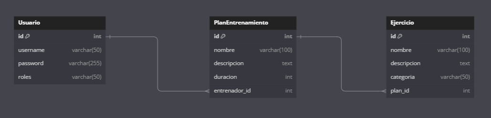

# Planteamiento del Proyecto API REST: Planificación de Entrenamientos

## Introducción

El proyecto "Planificación de Entrenamientos" consiste en una API REST desarrollada para gestionar programas personalizados de entrenamiento físico. 
Este sistema está diseñado para facilitar la interacción entre entrenadores y clientes, ofreciendo herramientas para la creación, 
consulta y modificación de planes de entrenamiento y ejercicios, manteniendo una estructura de datos bien definida y una experiencia de usuario intuitiva.

## Objetivo General

Proveer un sistema eficiente que optimice la comunicación entre entrenadores y clientes, 
permitiendo que cada usuario administre sus planes y ejercicios de manera organizada y sencilla.

## Objetivos Específicos

El proyecto tiene como meta cumplir los siguientes objetivos clave:

- Permitir el registro de usuarios con roles específicos: ENTRENADOR y CLIENTE.
- Facilitar la creación y administración de planes de entrenamiento asignados a entrenadores.
- Incorporar ejercicios a los planes de entrenamiento, clasificados por categorías.
- Implementar un sistema de seguridad robusto para garantizar la autenticación y autorización de usuarios.

## Estructura del Proyecto

El sistema se basa en una arquitectura de tres capas, que asegura una separación clara de responsabilidades:

### Modelo

Define las entidades principales: Usuario, PlanEntrenamiento, y Ejercicio, junto con sus relaciones.

## Tablas de la Base de Datos

**Idea principal:**
Estructurar la base de datos para soportar la gestión de usuarios, planes de entrenamiento y ejercicios, estableciendo relaciones claras entre las entidades clave.

#### Tabla 1: usuario

**Descripción:**
Almacena la información de los usuarios registrados en el sistema, permitiendo diferenciarlos según su rol (ENTRENADOR o CLIENTE).

| Columna  | Tipo          | Descripción                                      |
|----------|---------------|--------------------------------------------------|
| id       | BIGINT        | Identificador único del usuario (clave primaria).|
| username | VARCHAR(255)  | Nombre único del usuario.                        |
| password | VARCHAR(255)  | Contraseña en formato seguro.                    |
| role     | VARCHAR(255)  | Rol del usuario (ENTRENADOR o CLIENTE).          |

**Relaciones:**
- `id` se asocia con `entrenador_id` en la tabla `plan_entrenamiento`.

#### Tabla 2: plan_entrenamiento

**Descripción:**
Define los planes de entrenamiento que pertenecen a un entrenador, con una descripción clara y duración en días.

| Columna       | Tipo          | Descripción                                      |
|---------------|---------------|--------------------------------------------------|
| id            | BIGINT        | Identificador único del plan (clave primaria).   |
| nombre        | VARCHAR(255)  | Nombre del plan de entrenamiento.                |
| descripcion   | VARCHAR(500)  | Descripción detallada del plan.                  |
| duracion      | INTEGER       | Duración del plan en días.                       |
| entrenador_id | BIGINT        | Identificador del entrenador propietario del plan.|

**Relaciones:**
- `entrenador_id` hace referencia a `id` en la tabla `usuario`.

#### Tabla 3: ejercicio

**Descripción:**
Guarda información sobre los ejercicios asociados a un plan de entrenamiento.

| Columna       | Tipo          | Descripción                                      |
|---------------|---------------|--------------------------------------------------|
| id            | BIGINT        | Identificador único del ejercicio (clave primaria).|
| nombre        | VARCHAR(255)  | Nombre del ejercicio.                            |
| descripcion   | VARCHAR(500)  | Detalles sobre el ejercicio.                     |
| categoria     | VARCHAR(255)  | Categoría del ejercicio (e.g., Fuerza, Cardio).  |
| plan_id       | BIGINT        | Identificador del plan al que pertenece el ejercicio.|

**Relaciones:**
- `plan_id` hace referencia a `id` en la tabla `plan_entrenamiento`.

### Servicio

Contiene la lógica de negocio, gestionando las reglas específicas para la asociación entre entrenadores, clientes y sus respectivos planes de entrenamiento.

### Controlador

Expone los endpoints de la API, permitiendo a los usuarios interactuar con el sistema de manera eficiente.

Este proyecto ofrece una solución digital que responde a estas necesidades mediante un sistema seguro, escalable y fácil de usar, contribuyendo a la mejora de la experiencia tanto de entrenadores como de clientes.
